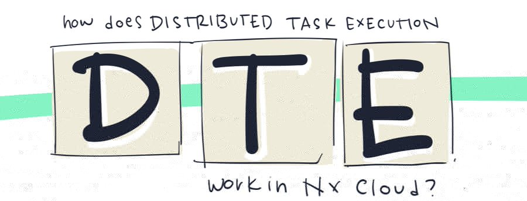
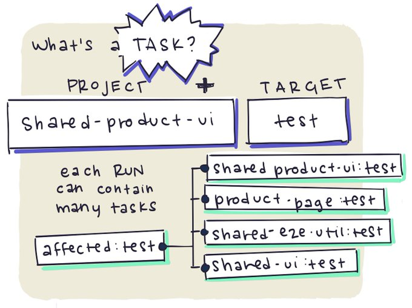
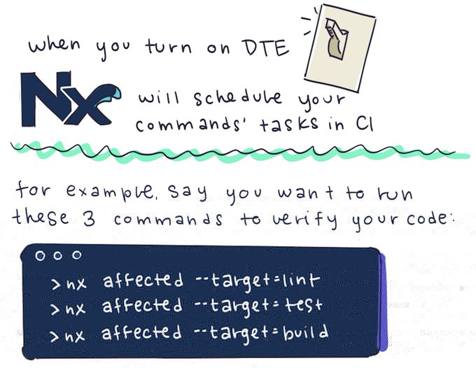
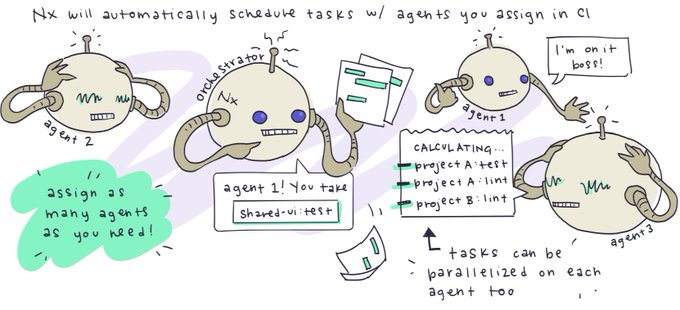
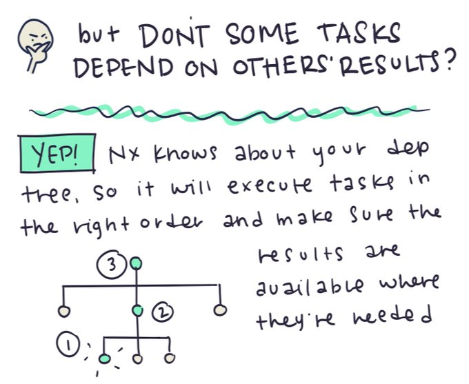
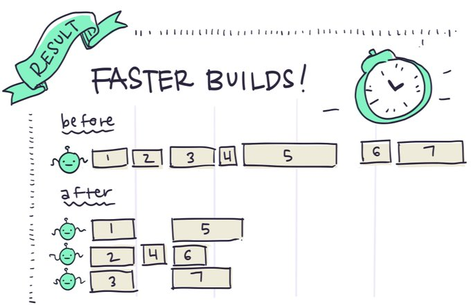
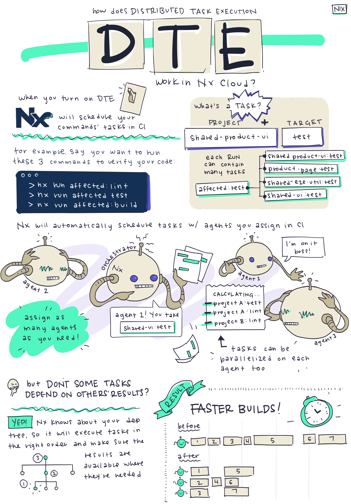

# Distributed Task Execution Guide

The illustrations in this guide are created by Nrwlian [Nicole Oliver](https://twitter.com/nixcodes)

## What's a Task?

A task, from Lerna's perspective, is a target running on a project.  i.e. The target `test` running on the project `shared-product-ui` is a task.  For more information about tasks, see the [Run Tasks article](../features/run-tasks).

## Nx Cloud Schedules Your CI Tasks Automatically

Let's imagine for every PR in CI, you want to lint, test and build all affected projects.  When you write your CI workflow, you have no way of knowing how many projects will be affected by each PR or how long each task will take.  No matter how carefully you set things up, there will be wasted time if you manually assign a static number of agent machines for linting, testing and building.  This approach is called binning.

Luckily, with distributed task execution, Nx Cloud can dynamically assign tasks to agents as they become available.

## Nx Cloud Efficiently Orchestrates Agents

When you set up DTE, you define (1) the tasks that you want to run and (2) the number of agents that are available for Nx Cloud to use.  Then the Nx Cloud orchestrator distributes tasks to agents efficiently - so that all the agents are being fully utilized and your CI process finishes as soon as possible.

## Task Execution Order Matters

There are some tasks that need to be executed before other tasks, but Nx Cloud takes that into account when it assigns tasks to agents.  For a more detailed look at defining those dependencies, read the [Run Tasks article](../features/run-tasks).

## Why Distribute Tasks?

Efficiently parallelizing your CI process across many agents can dramatically speed up your CI, which helps developers identify problems faster and get more work done.

## What Does It Cost?

Nx Cloud is FREE for open source projects.  Contact cloud-support@nrwl.io to get set up.

For closed source projects, the first 500 computation hours per month are free.  Most workspaces don't exceed this amount.  No credit card is required.  After 500 hours, the cost is $1 per computation hour.

For more details, see the [Nx Cloud pricing page](https://nx.app/pricing).

## Security

Your actual code is not stored in the cloud, but the hashed inputs and cached results of your tasks are.  It is possible to enable end to end encryption of that data so that no one can view that information without your key.  Also, if you want to host Nx Cloud on your own servers, you can sign up for Nx Private Cloud.

## Example

[This is an example repo](https://github.com/vsavkin/lerna-dte) showing how easy it is to set up distributed task
execution, showing the performance gains, and comparing to sharding/binning.

## Illustration

Here is the full illustrated explanation page that [Nicole Oliver](https://twitter.com/nixcodes) made:

