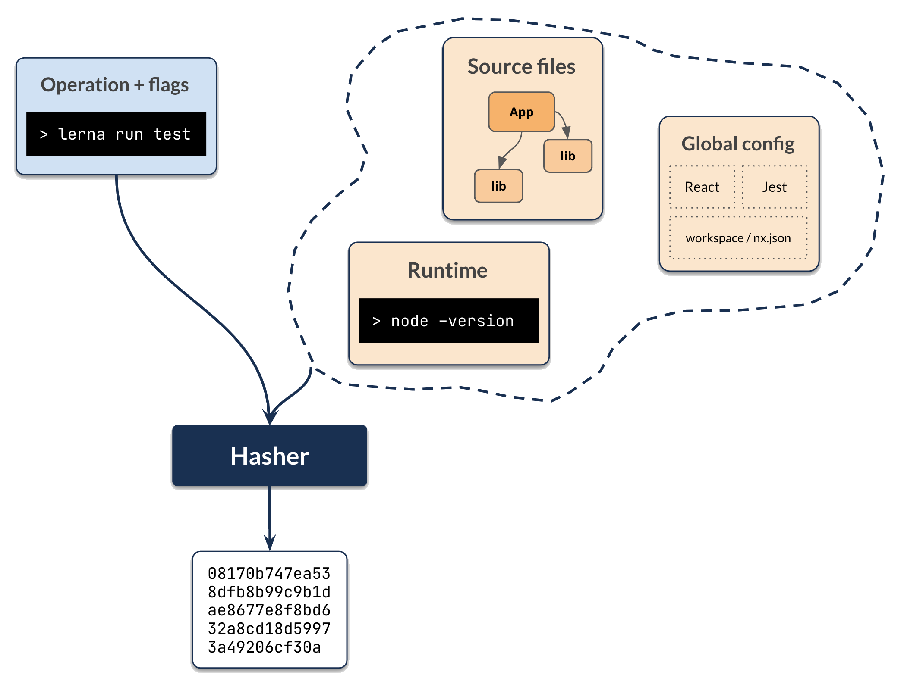
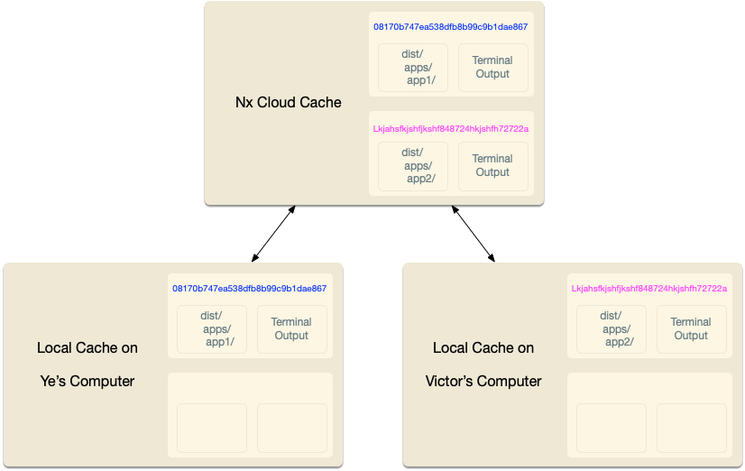
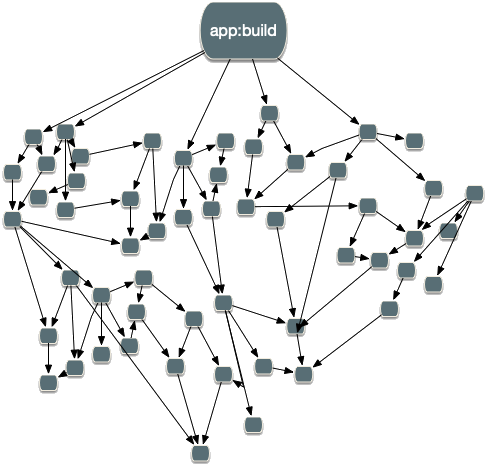

# How Caching Works

Before running any task, Lerna computes its computation hash. As long as the computation hash is the same, the output of
running the task is the same.

By default, the computation hash for - say - `lerna run test --scope=remixapp` includes:

- All the source files of `remixapp` and its dependencies
- Relevant global configuration
- Versions of external dependencies
- Runtime values provisioned by the user such as the version of Node
- CLI Command flags

<!--  -->



> This behavior is customizable. For instance, lint checks may only depend on the source code of the project and global
> configs. Builds can depend on the dts files of the compiled libs instead of their source.

After Lerna computes the hash for a task, it then checks if it ran this exact computation before. First, it checks
locally, and then if it is missing, and if a remote cache is configured, it checks remotely.

If Lerna finds the computation, Lerna retrieves it and replays it. Lerna places the right files in the right folders and
prints the terminal output. From the user’s point of view, the command ran the same, just a lot faster.



If Lerna doesn’t find a corresponding computation hash, Lerna runs the task, and after it completes, it takes the
outputs and the terminal logs and stores them locally (and if configured remotely as well). All of this happens
transparently, so you don’t have to worry about it.

Although conceptually this is fairly straightforward, Lerna optimizes this to make this experience good for you. For
instance, Lerna:

- Captures stdout and stderr to make sure the replayed output looks the same, including on Windows.
- Minimizes the IO by remembering what files are replayed where.
- Only shows relevant output when processing a large task graph.
- Provides affordances for troubleshooting cache misses. And many other optimizations.

As your workspace grows, the task graph looks more like this:



All of these optimizations are crucial for making Lerna usable for any non-trivial workspace. Only the minimum amount of
work happens. The rest is either left as is or restored from the cache.

## Source Code Hash Inputs

The result of building/testing an application or a library depends on the source code of that project and all the source
codes of all the libraries it depends on (directly or indirectly).

By default, Lerna is conservative. When running,
say, `lerna run test --scope=remixapp` Lerna will consider all the files in the `remixapp` directory and all the files
in the `header` and `footer` directories (`remixapp` dependencies). This would result in unnecessary cache misses. For
instance, we know that changing a `footer`'s spec file will not change the result of the test command above.

We can define a more precise configuration as follows:

> NOTE: "{projectRoot}" and "{workspaceRoot}" are special syntax supported by the task-runner, which will be appropriately interpolated internally when the command runs. You should therefore not replace "{projectRoot}" or "{workspaceRoot}" with fixed paths as this makes your configuration less flexible.

```json title="nx.json"
{
  "namedInputs": {
    "default": ["{projectRoot}/**/*"],
    "prod": ["!{projectRoot}/**/*.spec.tsx"]
  },
  "targetDefaults": {
    "build": {
      "inputs": ["prod", "^prod"]
    },
    "test": {
      "inputs": ["default", "^prod", "{workspaceRoot}/jest.config.ts"]
    }
  }
}
```

With this configuration, the build script will only consider the non-test files of `remixapp`, `header` and `footer`.
The test script will consider all the source files for the project under test and only non-test files of its
dependencies. The test script will also consider the jest config file at the root of the workspace.

## Runtime Hash Inputs

Your targets can also depend on runtime values.

```json title="nx.json"
{
  "targetDefaults": {
    "build": {
      "inputs": [{ "env": "MY_ENV_NAME" }, { "runtime": "node -v" }]
    }
  }
}
```

## Args Hash Inputs

Finally, in addition to Source Code Hash Inputs and Runtime Hash Inputs, Lerna needs to consider the arguments: For
example, `lerna run build --scope=remixapp` and `lerna run build --scope=remixapp -- --flag=true` produce different
results.

Note, only the flags passed to the npm scripts itself affect results of the computation. For instance, the following
commands are identical from the caching perspective.

```bash
npx lerna run build --scope=remixapp
npx lerna run build --ignore=header,footer
```

In other words, Lerna does not cache what the developer types into the terminal.

If you build/test/lint… multiple projects, each individual build has its own hash value and will either be retrieved
from
cache or run. This means that from the caching point of view, the following command:

```bash
npx lerna run build --scope=header,footer
```

is identical to the following two commands:

```bash
npx lerna run build --scope=header
npx lerna run build --scope=footer
```

## What is Cached

Lerna works on the process level. Regardless of the tools used to build/test/lint/etc.. your project, the results are
cached.

Lerna sets up hooks to collect stdout/stderr before running the command. All the output is cached and then replayed
during a cache hit.

Lerna also caches the files generated by a command. The list of files/folders is listed in the `outputs` property of the
project's `package.json`:

> NOTE: "{projectRoot}" and "{workspaceRoot}" are special syntax supported by the task-runner, which will be appropriately interpolated internally when the command runs. You should therefore not replace "{projectRoot}" or "{workspaceRoot}" with fixed paths as this makes your configuration less flexible.

```json title="E.g. packages/my-project/package.json"
{
  "nx": {
    "targets": {
      "build": {
        "outputs": ["{projectRoot}/build", "{projectRoot}/public/build"]
      }
    }
  }
}
```

If the `outputs` property for a given target isn't defined in the project'
s `package.json` file, Lerna will look at the `targetDefaults` section of `nx.json`:

```json title="nx.json"
{
  ...
  "targetDefaults": {
    "build": {
      "dependsOn": [
        "^build"
      ],
      "outputs": [
        "{projectRoot}/dist",
        "{projectRoot}/build",
        "{projectRoot}/public/build"
      ]
    }
  }
}
```

If neither is defined, Lerna defaults to caching `dist` and `build` at the root of the repository.

## Skipping Cache

Sometimes you want to skip the cache. If, for example, you are measuring the performance of a command, you can use
the `--skip-nx-cache` flag to skip checking the computation cache.

```bash
npx lerna run build --skip-nx-cache
npx lerna run test --skip-nx-cache
```

## Customizing the Cache Location

The cache is stored in `node_modules/.cache/nx` by default. To change the cache location, update the `cacheDirectory`
option for the task runner in `nx.json`:

```json
{
  "tasksRunnerOptions": {
    "default": {
      "options": {
        "cacheableOperations": ["build", "test"],
        "cacheDirectory": "/tmp/mycache"
      }
    }
  }
}
```
