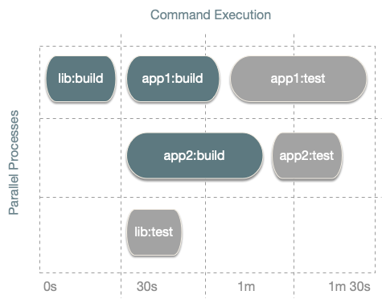

# Task Pipeline Configuration

Lerna delegates the running of npm scripts (forking processes etc) to Nx. The `nx.json` file is the place where you can
configure how Nx does it.

:::tip

If you don't have `nx.json`, run `npx nx init`.

:::

## Run Tasks in Parallel

If you want to increase the number of processes running the scripts to, say, 5 (by default, it is 3), pass the
following:

```bash
npx lerna run build --concurrency=5
```

Note, you can also change the default in `nx.json`, like this:

```json title="nx.json"
{
  "tasksRunnerOptions": {
    "default": {
      "runner": "nx/tasks-runners/default",
      "options": {
        "cacheableOperations": [],
        "parallel": 5
      }
    }
  }
}
```


## Allow Tasks to Run in Any Order

To run the `test` script for each of the projects, run the following:

```bash
npx lerna run test --no-sort
```

You should see the following output:

```bash title="Terminal Output"
    ✔  footer:test (1s)
    ✔  header:test (1s)
    ✔  remixapp:test (236ms)

 ——————————————————————————————————————————————————————————————————————————————

 >  Lerna (powered by Nx)   Successfully ran target test for 3 projects (1s)
```

Note that we are passing `--no-sort` to tell Lerna that tasks can run in any order.

## Define Task Dependencies (aka Task Pipelines)

Without our help Lerna cannot know what targets (scripts) require order and which don't. That's why you can
pass `--sort` and `--no-sort`, but this isn't the best way to go about it.

If builds have to run in the topological order, they **always** have to run in that order; otherwise things will be broken. On the other hand, if tests can run in any order, it never make sense to run them in topological order. That would only make them slower.

A better way to do it is to tell Lerna how targets relate. Add the following to `nx.json`:

```json title="nx.json"
{
  ...
  "targetDefaults": {
    "build": {
      "dependsOn": ["^build"]
    }
  }
}
```

With this, Lerna knows that before it can build a project, it needs to build all of its dependencies first. There are,
however, no constraints on tests.

> Once you define the `targetDefaults` property the sort flag is ignored.

This mechanism is very flexible. Let's look at this example:

```json title="nx.json"
{
  ...
  "targetDefaults": {
    "build": {
      "dependsOn": ["^build", "prebuild"]
    },
    "test": {
      "dependsOn": ["build"]
    }
  }
}
```

> Note, older versions of Nx used targetDependencies instead of targetDefaults. Both still work, but targetDefaults is
> recommended.

When running `lerna run test --scope=myproj`, the above configuration would tell Lerna to

1. Run the `test` command for `myproj`
2. But since there's a dependency defined from `test -> build` (see `test:["build"]`), Lerna runs `build` for `myproj`
   first.
3. `build` itself defines a dependency on `prebuild` (on the same project) as well as `build` of all the dependencies.
   Therefore, it will run the `prebuild` script and will run the `build` script for all the dependencies.

Note, Lerna doesn't have to run all builds before it starts running tests. The task orchestrator will run as many tasks
in parallel as possible as long as the constraints are met.

Situations like this are pretty common:



Because we described the rules in `nx.json`, they will apply to all the projects in the repo. You can also define
project-specific rules by adding them the project's `package.json`.

```json
{
  ...
  "nx": {
    "targets": {
      "test": {
        "dependsOn": [
          "build"
        ]
      }
    }
  }
}
```
