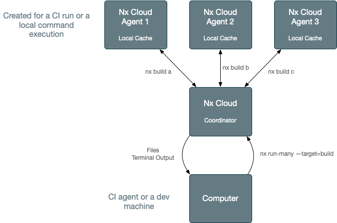

# Distributed Task Execution (DTE)

Lerna (via Nx) supports running commands across multiple machines. You can either set it up by hand (by using batching
or
binning) or use Nx Cloud.

[Read the comparison of the two approaches.](https://blog.nrwl.io/distributing-ci-binning-and-distributed-task-execution-632fe31a8953?source=friends_link&sk=5120b7ff982730854ed22becfe7a640a)

When using distributed task execution, Lerna (via Nx) is able to run any task graph on many agents instead of
locally.

For instance, `> npx lerna run build` won't run the builds locally (which can take hours for large workspaces). Instead,
it will send the Task Graph to Nx Cloud. Nx Cloud Agents will then pick up the tasks they can run and execute them.

Note that this happens transparently. If an agent builds `remixapp`, it will fetch the outputs for `header` and `footer`
if it doesn't have them already.

As agents complete tasks, the main job where you invoked `> npx lerna run build` will start receiving created files and
terminal outputs.

After `> npx lerna run build` completes, the original machine will have the build files and all the terminal outputs as if it ran
it locally.

## Example

[This is an example repo](https://github.com/vsavkin/lerna-dte) showing how easy it is to set up distributed task
execution, showing the performance gains, and comparing to sharding/binning.
