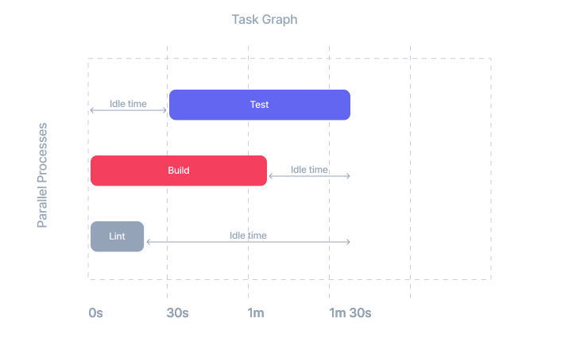
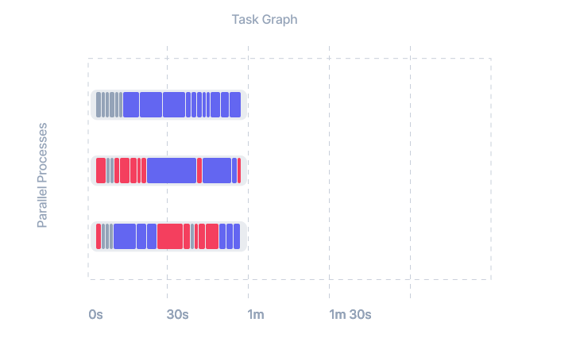

# Distribute Task Execution (DTE)

Lerna speeds up your average CI time with [caching](/docs/features/cache-tasks) and the `--since` flag. But neither of these features help with the worst case scenario. When something at the core of your repo has been modified and every task needs to be run in CI, the only way to improve the performance is by adding more agent jobs and efficiently parallelizing the tasks.

The most obvious way to parallelize tasks is to split tasks up by type: running all tests on one job, all builds on another and all lint tasks on a third. This strategy is called binning. This can be made difficult if some test tasks have build tasks as prerequisites, but assuming you figure out some way to handle that, a typical set up can look like the diagram below. Here the test tasks are delayed until all necessary build artifacts are ready, but the build and lint tasks can start right away.



The problem with the binning approach is you'll end up with some idle time on one or more jobs. Nx's distributed task execution reduces that idle time to the minimum possible by assigning each individual task to agent jobs based on the task's average run time. Nx also guarantees that tasks are executed in the correct order and uses distributed caching to make sure that build artifacts from previous tasks are present on every agent job that needs them.

When you set up Nx's distributed task execution, your task graph will look more like this:



And not only will CI finish faster, but the debugging experience is the same as if you ran all of your CI on a single job. That's because Nx uses distributed caching to recreate all of the logs and build artifacts on the main job.

Find more information in this [detailed guide to improve your worst case CI times](https://nx.dev/concepts/dte).

## Set up

To distribute your task execution, you need to (1) connect to Nx Cloud and (2) enable DTE in your CI workflow. Each of these steps can be enabled with a single command:

```shell title="1. Connect to Nx Cloud"
nx connect-to-nx-cloud
```

```shell title="2. Enable DTE in CI"
nx generate @nrwl/workspace:ci-workflow --ci=github
```

The `--ci` flag can be `github`, `circleci` or `azure`. For more details on setting up DTE, read [this guide](https://nx.dev/nx-cloud/set-up/set-up-dte).

## CI Execution Flow

Distributed task execution can work on any CI provider. You are responsible for launching jobs in your CI system. Nx Cloud then coordinates the way those jobs work together. There are two different kinds of jobs that you'll need to create in your CI system.

1. One main job that controls what is going to be executed
2. Multiple agent jobs that actually execute the tasks

The main job execution flow looks like this:

```yaml
# Coordinate the agents to run the tasks
- npx nx-cloud start-ci-run
# Run any commands you want here
- lerna run lint --since=main & lerna run test --since=main & lerna run build --since=main
# Stop any run away agents
- npx nx-cloud stop-all-agents
```

The agent job execution flow is very simple:

```yaml
# Wait for tasks to execute
- npx nx-cloud start-agent
```

The main job looks more or less the same way as if you haven't used any distribution. The only thing you need to do is
to invoke `npx nx-cloud start-ci-run` at the beginning and optionally invoke `npx nx-cloud stop-all-agents` at the end.

The agent jobs run long-running `start-agent` processes that execute all the tasks associated with a given CI run. The
only thing you need to do to set them up is to invoke `npx nx-cloud start-agent`. This process will keep running until
Nx Cloud tells it to terminate.

> Note it's important that the main job and the agent jobs have the same environment and the same source code. They start
> around the same time. And, once the main job completes, all the agents
> will be stopped.

It's also important to note that an Nx Cloud agent isn't a machine but rather a long-running process that runs on a
machine. I.e., Nx Cloud doesn't manage your agents--you need to do it in your CI config (check out CI examples below).

Nx Cloud is an orchestrator. The main job tells Nx Cloud what you want to run, and Nx Cloud will distribute those tasks
across the agents. Nx Cloud will automatically move files from one agent to another, from the agents to the main job.

The end result is that when say `lerna run build --since=main` completes on the main job, all the file artifacts created
on agents are copied over to the main job, as if the main job had built everything locally.

## Running Things in Parallel

`--concurrency` is propagated to the agents. E.g., `npx lerna run build --since=main --concurrency=3 --dte` tells Nx Cloud to run
up to 3 build targets in parallel on each agent. So if you have say 10 agents, you will run up to 30 builds in parallel
across all of them.

You also want to run as many commands in parallel as you can. For instance,

```yaml
- lerna run lint --since=main 
- lerna run test --since=main 
- lerna run build --since=main
```

is worse than

```yaml
- lerna run lint --since=main & lerna run test --since=main & lerna run build --since=main
```

The latter is going to schedule all the three commands at the same time, so if an agent cannot find anything to build, it will start running tests and lints. The result is better agent utilization and shorter CI time.

## CI/CD Examples

The examples below show how to set up CI using Nx and Nx Cloud using distributed task execution and distributed caching.

Every organization manages their CI/CD pipelines differently, so the examples don't cover org-specific aspects of
CI/CD (e.g., deployment). They mainly focus on configuring Nx correctly.

Read the guides for more information on how to configure them in CI.

- [Overview](https://nx.dev/recipes/ci/ci-setup#distributed-ci-with-nx-cloud)
- [Azure Pipelines](https://nx.dev/recipes/ci/monorepo-ci-azure#distributed-ci-with-nx-cloud)
- [Circle CI](https://nx.dev/recipes/ci/monorepo-ci-circle-ci#distributed-ci-with-nx-cloud)
- [GitHub Actions](https://nx.dev/recipes/ci/monorepo-ci-github-actions#distributed-ci-with-nx-cloud)
- [Jenkins](https://nx.dev/recipes/ci/monorepo-ci-jenkins#distributed-ci-with-nx-cloud)

Note that only cacheable operations can be distributed because they have to be replayed on the main job.

## Relevant Repositories and Examples

- [Nx: On how to make your CI 16 times faster with a small config change](https://github.com/vsavkin/interstellar)
- ["Lerna & Distributed Task Execution" Example](https://github.com/vsavkin/lerna-dte)
