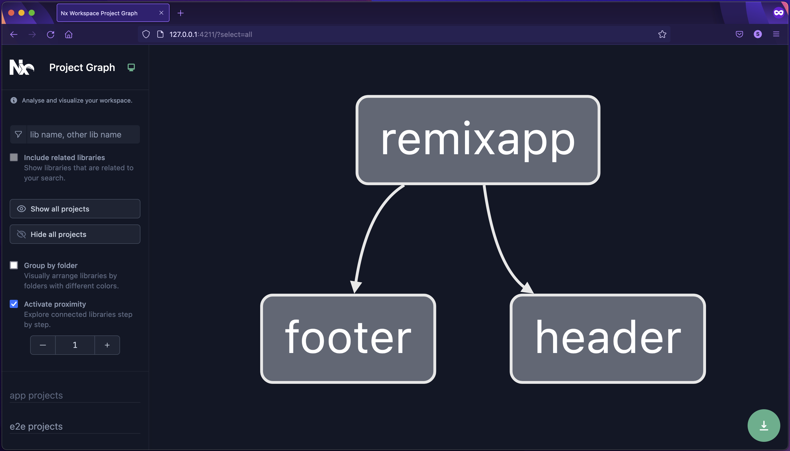

# Getting Started

<iframe width="560" height="315" src="https://www.youtube.com/embed/WgO5iG57jeQ" title="YouTube video player" frameborder="0" allow="accelerometer; autoplay; clipboard-write; encrypted-media; gyroscope; picture-in-picture; fullscreen" allowfullscreen></iframe>

You can incrementally adopt Lerna for existing monorepos or create a new Lerna workspace by running:

```bash
npx lerna init
```

All Lerna functionality will work the same way regardless.

This tutorial will give you an introduction to Lerna's features. We will use [this repository](https://github.com/lerna/getting-started-example).

> To start the tutorial, clone the repo, check out the prelerna branch and follow along!

```bash
git clone https://github.com/lerna/getting-started-example.git
cd getting-started-example
git checkout prelerna
npm install
```

The repo contains three packages or projects:

- `header` (a library of React components)
- `footer` (a library of React components)
- `remixapp` (an app written using the Remix framework which depends on both `header` and `footer`)

```
packages/
    header/
        src/
            ...
        package.json
        rollup.config.json
        jest.config.js

    footer/
        src/
            ...
        package.json
        rollup.config.json
        jest.config.js

    remixapp/
        app/
            ...
        public/
        package.json
        remix.config.js

package.json
```

## Adding Lerna

To add Lerna run the following command:

```bash
npx lerna@latest init
```

This will generate `lerna.json` and will add `lerna` to the root `package.json`.

```json title="package.json"
{
  "name": "root",
  "private": true,
  "workspaces": ["packages/*"],
  "devDependencies": {
    "lerna": "5.1.6"
  }
}
```

What makes Lerna 5.1+ so powerful is the task delegation and other features that come with its integration
with [Nx](https://nx.dev).

## Visualizing Workspace

By having Nx installed alongside Lerna, you can use its capabilities to open an interactive visualization of the
workspace project graph.

To open the visualization, run:

```bash
npx nx graph
```



## Bootstrapping Projects

Bootstrapping is one of the three main key features of Lerna. It enables different projects in the same repository to
import each other without having to be published to a registry.

To see how it works, let for example inspect the `package.json` file of `remixapp`.

```json
{
  ...
  "dependencies": {
    "@remix-run/node": "^1.5.1",
    "@remix-run/react": "^1.5.1",
    "@remix-run/serve": "^1.5.1",
    "react": "^17.0.2",
    "react-dom": "^17.0.2",
    "header": "*",
    "footer": "*"
  }
}
```

The `"header": "*"` and `"footer": "*"` tell Lerna to link the contents of the `header` and `footer` as if they were
published to the registry. To do that, we need to run:

```bash
npx lerna bootstrap
```

Now all the projects in the workspace can properly reference each other so that they can now be built.

## Building All Projects

To build all projects, run

```bash
npx lerna run build
```

This builds the three projects in the right order: `header` and `footer` will be built first (and in parallel),
and `remixapp` will be built after. The order matters because the `remixapp` uses the bundles from the compiled `header`
and `footer`.

```
    ✔  header:build (501ms)
    ✔  footer:build (503ms)
    ✔  remixapp:build (670ms)

 —————————————————————————————————————————————————————————————————————————————

 >  Lerna (powered by Nx)   Successfully ran target build for 3 projects (1s)

```

## Testing All Projects

Now, let's run the tests.

```bash
npx lerna run test
```

You should see the following output:

```
    ✔  footer:test (1s)
    ✔  header:test (1s)
    ✔  remixapp:test (236ms)

 ——————————————————————————————————————————————————————————————————————————————

 >  Lerna (powered by Nx)   Successfully ran target test for 3 projects (1s)
```

Note, `lerna` will run the three `test` npm scripts in the topological order as well. Although we had to do it when
building, it isn't necessary for tests (and it also makes the command slower). We can change this behavior by
adding `--no-sort` to the command.

```bash
npx lerna run test --no-sort
```

## Caching

Running any command right now will execute all the tasks, every time, even when nothing changes. We can fix it by adding
a bit of configuration.

First, let's run

```bash
npx nx init
```

This which will generate a `nx.json` at the root of your workspace:

```json
{
  "tasksRunnerOptions": {
    "default": {
      "runner": "nx/tasks-runners/default",
      "options": {
        "cacheableOperations": []
      }
    }
  }
}
```

Second, let's mark `build` and `test` to be cacheable operations.

```json
{
  "tasksRunnerOptions": {
    "default": {
      "runner": "nx/tasks-runners/default",
      "options": {
        "cacheableOperations": ["build", "test"]
      }
    }
  }
}
```

Now, let's run tests on the header project twice. The second time the operation will be instant:

```bash
npx lerna run test --scope=header
```

```
> lerna run test --scope=header

> header:test  [existing outputs match the cache, left as is]

> header@0.1.0 test
> jest

PASS  src/Header.spec.tsx
✓ renders header (12 ms)

Test Suites: 1 passed, 1 total
Tests:       1 passed, 1 total
Snapshots:   0 total
Time:        0.439 s, estimated 1 s
Ran all test suites.

———————————————————————————————————————————————————————————————————————————————————————————————————————————————————————

>  Lerna (powered by Nx)   Successfully ran target test for project header (4ms)

   Nx read the output from the cache instead of running the command for 1 out of 1 tasks.
```

Lerna (powered by Nx) was able to recognize that the same command has already executed against the same relevant code
and environment, so instead running it Lerna restored the necessary files and replayed the terminal output.

Most of the time Lerna (powered by Nx) is good at recognizing what files need to be cached and restored. In case of
building the Remix app we need to help it by adding the following section to `packages/remixapp/package.json`.

> NOTE: "{projectRoot}" is a special syntax supported by the task-runner, which will be appropriately interpolated internally when the command runs. You should therefore not replace "{projectRoot}" with a fixed path as this makes your configuration less flexible.

```json
{
  "nx": {
    "targets": {
      "build": {
        "outputs": ["{projectRoot}/build", "{projectRoot}/public/build"]
      }
    }
  }
}
```

Caching not only restores the terminal output logs, but also artifacts that might have been produced.

Build all the projects, then remove the remix build folder and run the build command again.

```bash
npx lerna run build
rm -rf packages/remixapp/public/build
```

You will see all the files restored from cache and the command executing instantly.

```
    ✔  header:build  [existing outputs match the cache, left as is]
    ✔  footer:build  [existing outputs match the cache, left as is]
    ✔  remixapp:build  [local cache]

 ———————————————————————————————————————————————————————————————————————————————————————————————————————————————————————

 >  Lerna (powered by Nx)   Successfully ran target build for 3 projects (19ms)

    Nx read the output from the cache instead of running the command for 3 out of 3 tasks.
```

> Lerna also supports [distributed caching](./features/cache-tasks.md)
> and [config-free distributed task execution](./features/distribute-tasks.md).

## Target Dependencies (aka task pipelines)

We have made good progress, but there are two problems left to be solved:

1. We need to remember to use `--no-sort` when running tests.
2. We need to remember to build `header` and `footer` before we run `lerna run dev --scope=remixapp`.

Both are the symptoms of the same issue: by default, Lerna doesn't know how different targets (npm scripts) relate to
each other. We can fix that by defining dependencies between targets (also often known as task pipelines) in
the `nx.json`:

```json
{
  ...
  "targetDefaults": {
    "build": {
      "dependsOn": [
        "^build"
      ]
    },
    "dev": {
      "dependsOn": [
        "^build"
      ]
    }
  }
}
```

> Note, older versions of Nx used targetDependencies instead of targetDefaults. Both still work, but targetDefaults is
> recommended.

With this change:

- `npx lerna run build` will run the build targets in the right order.
- `npx lerna run dev --scope=remixapp` will run the build targets for `header` and `footer` first and then run the dev
  target for `remixapp`.
- `npx lerna run test` will run all the three test targets in parallel.

If you are wondering whether it is slow to run `lerna run dev --scope=remixapp` given that you have to rebuild all the
dependencies all the time, the answer is "no". The dependencies will be rebuilt only when they change. Otherwise,
their dist folders will be kept as is.

## Publishing

Finally, let's talk about the third key Lerna feature: publishing to npm. Lerna comes already with a `publish` command
built-in. To publish our packages `header` and `footer`, all we need to do is to run:

```bash
npx lerna publish --no-private
```

This will

- determine the current version of the packages
- detect which packages have changed since the last publishing & then update its version in `package.json` accordingly
- create a commit of the changed `package.json` files, tag the commit and push the tag & commit to the remote
- publish the packages to NPM

Read more about the publishing and versioning
process [in the corresponding docs page](./features/version-and-publish.md).
